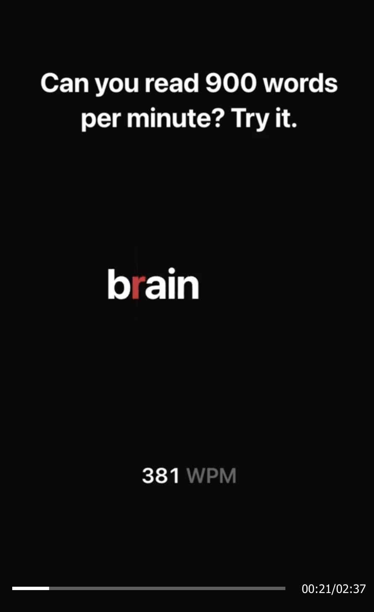
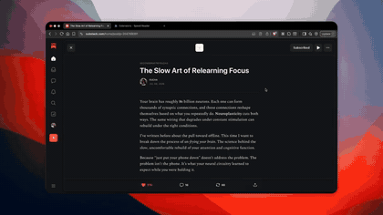

# speed reader

I was scrolling on my phone and came accross this TikTok about speed reading using Rapid Serial Visual Presentation (RSVP) method, so I made a browser extension that does this for content on your screen.



This is made using one prompt from GPT 5.6 Sol Medium, and under 10 prompts for refinements. Use it to train ur speed reading, or just have fun with it.

## The prompt I used

```text
Goal: Turn webpage articles into a full-screen RSVP reader.
Show one word at a time with one highlighted ORP letter.

User Flow:
User opens an article.
Clicks the extension.
Extension extracts the main body text.
Full-screen reader opens.
Words flash one at a time.
User controls speed, pause, rewind and skip.

Core Features:
Extract article body
Ignore nav, ads, comments and popups
Full-screen reading mode
One word shown at a time
Highlight ORP letter
Keep ORP fixed at screen centre
WPM speed control
Pause and resume
Rewind a few words
Keyboard shortcuts

For smart text extraction use Mozilla Readability. And use ORP logic for the focus letter
```

## Demo

<a href="assets/speed-reader-demo.mp4"></a>

## Try it on Desktop

```bash
npm install
npm run build
```

Go to `chrome://extensions`, turn on developer mode, click load unpacked, and choose the `dist` folder.

Open an article and click the speed reader extension. Press `space` to begin.
